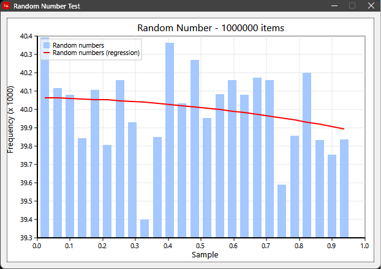

# Red Statistics Library

A lightweight, high-performance, and native statistical toolkit for the Red programming language. Designed with a functional programming workflow, this library provides comprehensive descriptive statistics, distribution tools, and built-in visualization capabilities with zero external dependencies.

## Features

* **Functional Pipeline Friendly:** Seamlessly integrates with the `|>` piping dialect.
    https://github.com/hinjolicious/functional
* **Flexible Aggregation:** Process datasets in a single pass using the generic `juxt-map` architecture.
* **Sample & Population Precision:** Dedicated refinements and functions to correctly handle unbiased sample metrics ($n-1$) versus true population metrics ($n$).
* **Native Visualizations:** Built-in charting engines utilizing Red's lightweight `draw` dialect.
    https://github.com/hinjolicious/plotter

---

## Installation

Include the core scripts at the top of your Red file:

```red
#include %fp.red
#include %stats.red

```

---

## Core API & Architecture

### 1. Unified Summary with `juxt-map`

Instead of processing data multiple times, use `juxt-map` to pass a block of operations over your dataset to output a structured map of metrics instantly.

```red
data: [22 86 24 97 66 42 25 70 54 3 54 45 2 95 95 77 62 ...]

analysis: data |> [juxt-map it [
    'mean         mean
    'median       median 
    'stddev       stddev 
    'stddev-pop   stddev/pop
    'variance     variance 
    'variance-pop variance/pop 
    'mad          mad
    'gini         gini
]]

probe analysis
; Executing returns a structured map of your metrics:
; [
;     mean: 49.74
;     median: 51.0
;     stddev: 31.56510667803865
;     variance-pop: 986.3924000000005
;     ...
; ]

```

### 2. Sample vs. Population Defaults

To protect the mathematical integrity of your data analysis, functions default to **Sample** formulas (using Bessel's correction $n-1$). True population calculations are explicitly exposed via `/pop` refinement:

* `stddev` vs. `stddev/pop`
* `variance` vs. `variance/pop`
* `skewness` vs. `skewness/pop`
* `kurtosis` / `excess-kurtosis` vs. `kurtosis/pop` / `kurtosis/excess/pop`

### 3. Advanced Descriptive Metrics

Go beyond basics with robust estimation and inequality metrics:

* **`mad`**: Mean Absolute Deviation (fully optimized).
* **`median-skewness`**: Pearson's second skewness coefficient, highly resistant to extreme outliers.
* **`gini`**: Scale-invariant coefficient measuring statistical dispersion and resource inequality.
* **`upper-outliers` / `lower-outliers**`: Computes standard Tukey's Fences ($1.5 \times \text{IQR}$) thresholds.

### 4. Frequency Analysis

Two distinct tools built for categorization vs. distribution shape modeling:

* **`top-freq data n`**: Returns a ranked list of the top $n$ unique samples paired with their frequencies.
```red
top-freq data 2 ; Target common elements -> [[95 4] [4 3]]

```


* **`freq-dist [data bins]`**: Groups data into a specific number of sequential intervals. Returns an array containing split intervals and parallel frequency counts—optimized to feed graphing routines.
```red
freq-dist data 10 ; Generates parallel bin/count arrays

```


---

## Data Visualization (Very Early: please see the plotting example!)



The library includes a native renderer built straight into Red's `draw` dialect. You can plot frequency distributions, set custom graph margins, and overlay trend regressions without touching external bindings.

```red
; Plot a 10-bin histogram with an overlaid trend curve
view [
    title "Data Distribution"
    size 800x600
    box 760x560 draw [
        plot-histogram [freq-dist data 10] /with-regression
    ]
]

```

---

## Performance Considerations

* **`vector!` vs `block!`:** For small datasets, raw Red blocks work flawlessly. For massive calculations (e.g., $100,000+$ items), using the homogenous `vector!` type significantly limits memory overhead and boosts performance.
* Core looping utilities leverage rapid math execution pipelines to keep data science scripts fast and lightweight.

